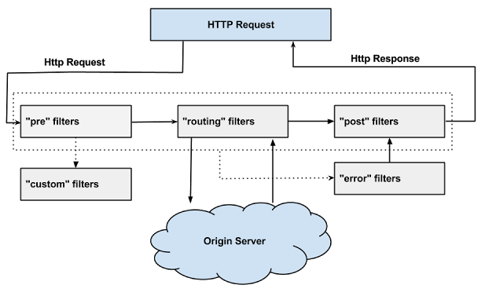

# microservice
Demo for Java micro service


# 微服务介绍
## 微服务架构4个核心问题？ 网络不可靠（本质原因）
1. 服务很多，客户端该怎么访问
2. 这么多服务，服务之间如何通讯
3. 这么多服务，服务如何治理
4. 服务挂了怎么办

万变不离其宗： 
1. API（路由问题）
2. HTTP、RPC（通信问题）
3. 注册和发现（高可用问题）
4. 熔断机制（服务降级问题）

## 解决方案：
1. Spring Cloud Netflix 一站式解决方案！
    - api网关： zuul组件
    - Feign -- HttpClient ---- Http通讯通讯方式，同步，阻塞
    - 服务注册发现：Eureka
    - 熔断机制： Hystrix
    
2. Apache Dubbo Zookeeper 半自动，需要整合其他的！
    - API：没有，找第三方组件，或者自己实现
    - 通讯协议：Dubbo
    - 服务注册发现：zookeeper
    - 熔断机制：没有，可以整合Hystrix
    
3. Spring Cloud Alibaba 新的一站式解决方案！ 更简单

4. 新概念：服务网格~ Service Mesh：istio

## SpringBoot和SpringCloud关系
- SpringBoot专注于快速方便的开发单个个体微服务，SpringCloud关助全局的服务治理框架
- SpringCloud是关注全局的微服务协调整理治理框架，他将SpringBoot开发的一个个单体微服务整合并管理起来，为各个服务之间提供：配置管理，服务发现，端路由器，路由，微代理，事件总线，全局锁，决策竞选，分布式会话等集成服务
- SpringBoot可以离开SpringCloud独立使用，开发项目，但是SpringCloud离不开SpringBoot，属于依赖关系


# 微服务优缺点  
## 优点：
- 单一职责原则
- 每个服务足够内聚，足够小，代码容易理解，这样能聚焦一个指定的业务功能或者业务需求
- 开发简单，开发效率提高，一个服务可能就是专一的只干一件事
- 微服务能够被小团队独立开发，这个小团队可以是2~5人的开发人员组成
- 微服务是松耦合的，是有功能意义的服务，无论是在开发阶段或部署阶段都是独立的
- 微服务能使用不同的语言开发
- 易于和第三方集成，微服务允许容易且灵活的方式集成自动部署，通过持续集成工具，如jenkins，Hudson，bamboo等
- 微服务易于被一个开发人员理解，修改和维护，这样小团队能够更关助自己的工作成果。无需通过合作才能体现价值
- 微服务允许你利用融合最新技术
- 微服务只是业务逻辑的代码，不会和HTML，CSS或其他界面混合
- 每个微服务都有自己的存储能力，可以有自己的数据库，也可以有统一的数据库

## 缺点：
- 开发人员要处理分布式系统的复杂性
- 多服务运维难度，随着服务的增加，运维的压力也在增加
- 系统部署依赖
- 服务间通信成本
- 数据一致性
- 系统集成测试
- 性能监控

# 微服务技术栈
|微服务条目|落地技术|
| :----: | :----: |
|服务开发|SpringBoot,Spring,SpringMVC|
|服务注册与管理|Archaius(Netfix),Diamond(阿里)|
|服务注册与发现|Euraka,Consul,Zookeeper|
|服务调用|Rest,RPC,gRPC|
|服务熔断器|Hystrix,Envoy等|
|负载均衡|Ribbon,Nginx等|
|服务接口调用（客户端调用服务的简化工具）|Feign等|
|消息队列|Kafka,RabbitMQ,ActiveMQ等|
|服务配置中心管理|SpringCloudConfig,Chef等|
|服务路由（API网关）|Zuul等|
|服务监控|Zabbix,Nagios,Metrics,Specatator等|
|全链路追踪|Zipkin,Brave,Dapper等|
|服务部署|Docker,OpenStock,Kubernetes等|
|数据流操作开发包|SpringCloud Stream(封装与Redis,Rabbit,Kafka等发送接受消息)|
|事件消息总线|SpringCloud Bus|

## SpringCloud与Dubbo的区别

|服务框架|SpringCloud|Dubbo|
| :----: | :----: | :----: |
|功能定位|完整的微服务框架（生态）|服务框架|
|支持Rest|是，Ribbon支持多种可拔插的序列化支持|否|
|支持RPC|否|是|
|支持多语言|是（Rest形式）|否|
|负载均可|是（服务端Zuul+客户端Ribbon）|是（客户端）|
|配置服务|Nexfix，SpringCloud Config Server|否|
|服务调用链监控|是（Zuul）|否|
|高可用|是（服务端Hystrix+客户端Ribbon）|是（客户端）|
|社区活跃度|高|2017年后重新开始维护，之间中断5年|
|学习难度|中等|低|
|文档丰富程度|高|高|
|其他|SpringCloud Bus为我们的应用程序带来了更多的管理端点|实践的公司比较多|


# Docker安装各种服务
### Dcoker安装mysql
创建mysql挂载文件夹 为了安全性，我们应该将数据和配置放到宿主机中，首先执行下面的命令创建data目录和config目录<br>

```
    mkdir docker-mysql
    cd docker-mysql
    mkdir data
    mkdir config
    cd config
    vi my.cnf
   ****************
    [mysqld]
    user=mysql
    character-set-server=utf8
    default_authentication_plugin=mysql_native_password
    [client]
    default-character-set=utf8
    [mysql]
    default-character-set=utf8
```

创建mysql容器

```
docker run -d -p 4306:3306 -h mysql --name mysql --restart always --privileged=true -v=/home/admin/docker-mysql/config/my.cnf:/etc/my.cnf -v=/home/admin/docker-mysql/data:/var/lib/mysql -e MYSQL_ROOT_PASSWORD="b4tsNS*rySoT" -e MYSQL_ROOT_HOST=% mysql:5.6
# -p 4306:3306 端口映射
# –restart always: 开机启动
# –privileged=true: 提升容器内权限
# -v=/root/docker-mysql/config/my.cnf:/etc/my.cnf: 映射配置文件
# -v=/root/docker-mysql/data:/var/lib/mysql: 映射数据目录
```

### Dcoker安装redis
```shell
docker pull redis
docker run -d -h redis --name redis --restart always --privileged=true redis
```
### Dcoker安装zookeeper
```shell
# 获取zookeeper镜像
docker pull zookeeper
# 启动zookeeper
docker run -d -p 2181:2181 -h zookeeper --name zookeeper1 --restart always --privileged=true zookeeper
# 进入zookeeper内部
docker exec -it zookeeper1 ./bin/zkCli.sh
```

# SpringCloud组件
## Euerka(AP原则)
服务启动后向Eureka注册，Eureka Server会将注册信息向其他Eureka Server进行同步，当服务消费者要调用服务提供者，则向服务注册中心获取服务提供者地址，然后会将服务提供者地址缓存在本地，下次再调用时，则直接从本地缓存中取，完成一次调用。

当服务注册中心Eureka Server检测到服务提供者因为宕机、网络原因不可用时，则在服务注册中心将服务置为DOWN状态，并把当前服务提供者状态向订阅者发布，订阅过的服务消费者更新本地缓存。

服务提供者在启动后，周期性（默认30秒）向Eureka Server发送心跳，以证明当前服务是可用状态。Eureka Server在一定的时间（默认90秒）未收到客户端的心跳，则认为服务宕机，注销该实例。

### 自我保护机制
在默认配置中，Eureka Server在默认90s没有得到客户端的心跳，则注销该实例，但是往往因为微服务跨进程调用，网络通信往往会面临着各种问题，比如微服务状态正常，但是因为网络分区故障时，Eureka Server注销服务实例则会让大部分微服务不可用，这很危险，因为服务明明没有问题。

为了解决这个问题，Eureka 有自我保护机制，通过在Eureka Server配置如下参数，可启动保护机制。

```shell script
eureka.server.enable-self-preservation=true
```

它的原理是，当Eureka Server节点在短时间内丢失过多的客户端时（可能发送了网络故障），那么这个节点将进入自我保护模式，不再注销任何微服务，当网络故障回复后，该节点会自动退出自我保护模式。


### 三大角色
- Euerka Server：提供服务的注册发现
- Euerka Provider：将自身服务注册到Eureka中，从而使消费方能够找到
- Service Consumer：服务消费方从Eureka中获取注册服务列表，从而找到消费服务

### Zookeeper和Eureka对比
#### CAP原则
- C(Consistency) 强一致性
- A(Avaliablity) 可用性
- P(Partition Tolerance) 分区容错性

一个分布式系统不可能同时很好的满足一致性，可用性和分区容错性者三个需求

根据CAP原理，将NoSQL数据库分成了满足CA、CP、AP原则三大类
- CA：单点集群，通常拓展性较差
- CP：通常性能不是特别高
- AP：通常可能对一致性要求低

#### Zookeeper保证的是CP
当向注册中心查询服务列表时，我们可以容忍注册中心返回的是几分钟以前的注册信息，但不能接受服务直接down掉不可用。也就是说，服务注册功能对可用性的要求要高于一致性。

但是zk会出现这样一种情况，当master节点因为网络故障与其他节点失去连接时，剩余节点会重新进行leader选举。当选举时间过长时，整个选举期间整个zk集群是不可用的，这就导致在选举期间注册服务瘫痪。在云部署的情况下，因为网络问题使得zk集群失去master节点是较大概率会发生的事情，虽然服务最终能够回复，但是漫长的选举时间导致的注册长期不可用是不能容忍的。

#### Eureka保证的是AP
eureka优先保证可用性。在Eureka平台中，如果某台服务器宕机，Eureka不会有类似于ZooKeeper的选举leader的过程；客户端请求会自动切换 到新的Eureka节点；当宕机的服务器重新恢复后，Eureka会再次将其纳入到服务器集群管理之中；

除此之外，Eureka还有一种自我保护机制，如果在15分钟内超过85%的节点都没有正常的心跳，那么Eureka就认为客户端与注册中心出现了网络故障，此时会出现以下几种情况：
1. Eureka不再从注册列表中移除因为长时间没收到心跳而应该过期的服务
2. Eureka仍然能够接受新服务的注册和查询请求，但是不会被同步到其它节点上(即保证当前节点依然可用)
3. 当网络稳定时，当前实例新的注册信息会被同步到其它节点中Eureka还有客户端缓存功能（注：Eureka分为客户端程序与服务器端程序两个部分，客户端程序负责向外提供注册与发现服务接口）。 所以即便Eureka集群中所有节点都失效，或者发生网络分割故障导致客户端不能访问任何一台Eureka服务器；Eureka服务的消费者仍然可以通过 Eureka客户端缓存来获取现有的服务注册信息。甚至最极端的环境下，所有正常的Eureka节点都不对请求产生相应，也没有更好的服务器解决方案来解 决这种问题时；得益于Eureka的客户端缓存技术，消费者服务仍然可以通过Eureka客户端查询与获取注册服务信息。

## Ribbon(客户端负载均衡)
提供客户端的软件负载均衡算法，将NetFlix的中间层服务连接在一起。

负载均衡（LB load Balance）分类
- 集中式LB：在服务的消费方和提供方之间使用独立的LB设施，如Nginx，由该设施负责把访问请求通过某种策略转发至服务的提供方
- 进程是LB：
   1. 将LB逻辑集成到消费方，消费方从服务注册中心获知有那些地址可用，然后自己在从这些地址中选出一个合适的服务器
   2. Ribbon就属于进程内LB，他只是一个类库，集成与消费方进程，消费方通过他来获取服务提供方的地址
   
从LoadBalancerAutoConfiguration类上的注解可知，Ribbon实现负载均衡自动化配置需要满足下面两个条件：
- @ConditionalOnClass(RestTemplate.class)：RestTemplate必须存在于当前工程的环境中。
- @ConditionalOnBean(LoadBalancerClient.class)：在Spring的Bean工程中必须有LoadBalancerClient的实现bean。

该自动配置类，主要做了下面三件事：
- 创建了一个LoadBalancerInterceptor的Bean，用于实现对客户端发起请求时进行拦截，以实现客户端负载均衡。
- 创建了一个RestTemplateCustomizer的Bean，用于给RestTemplate增加LoadbalancerInterceptor
- 维护了一个被@LoadBalanced注解修饰的RestTemplate对象列表，并在这里进行初始化，通过调用RestTemplateCustomizer的实例来给需要客户端负载均衡的RestTemplate增加LoadBalancerInterceptor拦截器。

通过源码以及之前的自动化配置类，我们可以看到在拦截器中注入了LoadBalancerInterceptor的实现。当一个被@LoadBalanced注解修饰的RestTemplate对象向外发起HTTP请求时，会被LoadBalancerInterceptor类的intercept函数所拦截。由于我们在使用RestTemplate时候采用了服务名作为host，所以直接从HttpRequest的URI对象中通过getHost()就可以拿到服务名，然后调用execute函数去根据服务名来选择实例并发起实际的请求。

从RibbonClientConfiguration配置类，可以知道在整合时默认采用ZoneAvoidanceRule来实现负载均衡器。

我们再回到RibbonLoadBalancer的execute函数逻辑，在通过ZoneAwareLoaderBalancer的chooseServer函数获取了负载均衡策略分配到的服务实例对象server之后，将其内容包装成RibbonServer对象（该对象除了存储了服务实例的信息之外，还增加了服务名serviceId、是否需要使用HTTPS等其他信息），然后使用该对象再回调LoadBalancerInterceptor请求拦截器中LoadBalancerRequest的apply(final ServiceInstance instance)函数，向一个实际的具体服务实例发起请求，从而实现一开始以服务名为host的URI请求，到实际的host:post形式的具体地址的转换。

总结：它是如何通过LoadBalancerInterceptor拦截器对RequestTemplate的请求进行拦截，并利用Spring Cloud的负载均衡器LoadBalancerClient将以服务名为host的URI转换成具体的服务实例地址的过程。同时通过分析LoadBalancerClient的Ribbon实现RibbonLoadBalancerClient，可以知道在使用Ribbon实现负载均衡器的时候，实际使用的还是Ribbon中定义ILoadBalancer接口的实现，自动化配置会采用ZoneAwareLoadBalancer的实例来实现客户端负载均衡。

### 负载均衡策略
1. RoundRobinRule轮询：CAS保证线程安全
2. RandomRule随机
3. RetryRule轮询重试（重试采用的默认也是轮询）
4. WeightedResponseTimeRule响应速度决定权重：
5. BestAvailableRule最优可用（底层也有RoundRobinRule）：选择并发连接数较小的server发送请求。
6. AvailabilityFilteringRule可用性过滤规则（底层也有RoundRobinRule）：先过滤掉不可用的Server实例，再选择并发连接最小的实例。
7. ZoneAvoidanceRule区域内可用性能最优（默认）：基于AvailabilityFilteringRule基础上做的，首先判断一个zone的运行性能是否可用，剔除不可用的区域zone的所有server，然后再利用AvailabilityPredicate过滤并发连接过多的server。

   
   
## Feign负载均衡
feign是声明式的web service客户端，类似于controller调用service，Spring Cloud集成了Ribbon和Eureka，可在使用Feign时提供负载均衡的http客户端

feign主要是社区，大家都习惯面向接口变成。这个是很多开发人员的规范。调用微服务访问两种方法
1. 微服务名字（ribbon）
2. 接口和注解（feign）
   
在使用Ribbon + RestTemplate时，利用RestTemplate对Http请求的封装处理，形成了一套模板化的调用方法，但是在实际开发中，由于对服务依赖的调用可能不止一处，往往一个接口会被多处调用，所以通常都会针对每个微服务自行封装一些客户端类来包装这些依赖服务的调用。所以，Feign在此基础上做了进一步封装，由他来帮助我们定义和实现依赖服务接口的定义。
在Feign的实现下，我们只需要创建一个接口并使用注解的方式来配置他（类似于以前Dao接口上标注Mapper注解，现在是一个微服务接口上标注一个Feign注解即可）即可完成对服务提供方的接口绑定，简化了使用Spring Cloud Ribbon时，自动封装服务调用客户端的开发量

## Hystrix
Hystrix是一个用于处理分布式系统的延迟和容错的开源库，在分布式系统里，许多依赖不可避免的会调用失败，比如超时、异常等，Hystrix能够保证在一个依赖出问题的情况下，不会导致整个服务失败，避免级联故障，以提高分布式系统的弹性。

"断路器"本身是一种开关装置，但某个服务但愿发生故障之后，通过断路器的故障监控（类似熔断保险丝），想调用方返回一个服务预期的，可处理的备选响应（Fallback），而不是长时间的等待或者跑出方法无法处理的异常，这样就可以保证了服务调用方的线程不会被长时间、不必要的占用，从而避免了故障在分布式系统中的蔓延，乃至雪崩。

- 服务熔断
- 服务降级
- 服务隔离
- 服务限流
- 接近事实的监控

### Hystrix整个工作流如下：

1. 构造一个 HystrixCommand或HystrixObservableCommand对象，用于封装请求，并在构造方法配置请求被执行需要的参数；
2. 执行命令，Hystrix提供了4种执行命令的方法，后面详述；
    - execute():以同步堵塞方式执行run()，只支持接收一个值对象。hystrix会从线程池中取一个线程来执行run()，并等待返回值。
    - queue():以异步非阻塞方式执行run()，只支持接收一个值对象。调用queue()就直接返回一个Future对象。可通过 Future.get()拿到run()的返回结果，但Future.get()是阻塞执行的。若执行成功，Future.get()返回单个返回值。当执行失败时，如果没有重写fallback，Future.get()抛出异常。
    - observe():支持接收多个值对象，取决于发射源。调用observe()会返回一个hot Observable，也就是说，调用observe()自动触发执行run()/construct()，无论是否存在订阅者。
    - toObservable():支持接收多个值对象，取决于发射源。调用toObservable()会返回一个cold Observable，也就是说，调用toObservable()不会立即触发执行run()/construct()，必须有订阅者订阅Observable时才会执行。
3. 判断是否使用缓存响应请求，若启用了缓存，且缓存可用，直接使用缓存响应请求。Hystrix支持请求缓存，但需要用户自定义启动；
4. 判断熔断器是否打开，如果打开，跳到第8步；
5. 判断线程池/队列/信号量是否已满，已满则跳到第8步；
6. 执行HystrixObservableCommand.construct()或HystrixCommand.run()，如果执行失败或者超时，跳到第8步；否则，跳到第9步；
7. 统计熔断器监控指标；
8. 走Fallback备用逻辑
9. 返回请求响应

从流程图上可知道，第5步线程池/队列/信号量已满时，还会执行第7步逻辑，更新熔断器统计信息，而第6步无论成功与否，都会更新熔断器统计信息。

### 几种方法的关系


- execute()实际是调用了queue().get()
- queue()实际调用了toObservable().toBlocking().toFuture()
- observe()实际调用toObservable()获得一个cold Observable，再创建一个ReplaySubject对象订阅Observable，将源Observable转化为hot Observable。因此调用observe()会自动触发执行run()/construct()。

Hystrix总是以Observable的形式作为响应返回，不同执行命令的方法只是进行了相应的转换。

### 熔断器的三种状态
- 打开状态：一段时间内，达到一定次数的无法调用，并且多次检测没有恢复的计相，断路器完全打开，那么下次请求就不会请求到该服务
- 半开状态：短时间内，有恢复迹象，断路器会将部分请求发给该服务，正常调用时，断路器关闭
- 关闭状态：当服务一直出于正常状态，能正常调用

### 服务雪崩
复杂分布式体系结构中的应用程序有数十个依赖关系，每个依赖关系在某个时候将不可避免的失败！

多个微服务之间调用的时候，假设微服务A调用微服务B和微服务C，微服务B和微服务C又调用其他的微服务，这就是所谓的"扇出"，如果扇出的链路上某个微服务的调用响应时间过长或者不可用，对微服务A的调用就会占用越来越多的系统资源，今儿引起系统奔溃，所谓的"服务雪崩"

对于高流量的应用来说，歹意的后端依赖可能会导致所有服务器上的所有资源都在几秒内饱和。比失败更糟糕的是，这些应用程序还可能导致服务之间的延迟增加，备份队列，线程和其他系统资源紧张，导致整个系统发射管更多的级联故障，这些都表示需要对故障和延迟进行隔离和管理，以便单个依赖关系的失败，不能取消整个应用程序或系统。

### 服务熔断（服务端）
当某个服务不可用或长时间无响应时，会进行服务的降级，并禁止该节点微服务的调用，快速返回错误信息。Hystrix会监控微服务间调用的状况，当失败的调用到一定的阈值，缺省是5s内20次调用失败就会启动熔断机制，熔断机制的注解是@HystrixCommand

1. 调用allowRequest()判断是否允许将请求提交到线程池
    - 如果熔断器强制打开，circuitBreaker.forceOpen为true，不允许放行，返回。
    - 如果熔断器强制关闭，circuitBreaker.forceClosed为true，允许放行。此外不必关注熔断器实际状态，也就是说熔断器仍然会维护统计数据和开关状态，只是不生效而已。
2. 调用isOpen()判断熔断器开关是否打开
    - 如果熔断器开关打开，进入第三步，否则继续；
    - 如果一个周期内总的请求数小于circuitBreaker.requestVolumeThreshold的值，允许请求放行，否则继续；
    - 如果一个周期内错误率小于circuitBreaker.errorThresholdPercentage的值，允许请求放行。否则，打开熔断器开关，进入第三步。
3. 调用allowSingleTest()判断是否允许单个请求通行，检查依赖服务是否恢复
    - 如果熔断器打开，且距离熔断器打开的时间或上一次试探请求放行的时间超过circuitBreaker.sleepWindowInMilliseconds的值时，熔断器器进入半开状态，允许放行一个试探请求；否则，不允许放行。

### 服务降级（客户端）
降级，通常指业务高峰期，为了保证核心服务正常运行，需要停掉一些不太重要的业务，或者某些服务不可用时，执行备用逻辑从故障服务中快速失败或快速返回，以保障主体业务不受影响。Hystrix提供的降级主要是为了容错，保证当前服务不受依赖服务故障的影响，从而提高服务的健壮性。要支持回退或降级处理，可以重写HystrixCommand的getFallBack方法或HystrixObservableCommand的resumeWithFallback方法。

Hystrix在以下几种情况下会走降级逻辑：
- 执行construct()或run()抛出异常
- 熔断器打开导致命令短路
- 命令的线程池和队列或信号量的容量超额，命令被拒绝
- 命令执行超时

### 服务隔离
当大多是人在使用Tomcat时，多个HTTP服务会共享一个线程池，假设其中一个HTTP服务的响应特别慢，将造成服务响应时间延迟增加，这就会阻塞其他线程的调用，导致整个Tomcat线程池都被该服务占用，甚至拖垮整个Tomcat。因此，我们可以将某些特定的服务隔离出来，部影响其他服务的调用。

Hystrix实现服务隔离的两种方案
1. 线程池
2. 信号量

#### 降级回退方式
- Fail Fast 快速失败:快速失败是最普通的命令执行方法，命令没有重写降级逻辑。 如果命令执行发生任何类型的故障，它将直接抛出异常。              
- Fail Silent 无声失败:指在降级方法中通过返回null，空Map，空List或其他类似的响应来完成。
- Fallback: Static:指在降级方法中返回静态默认值。 这不会导致服务以“无声失败”的方式被删除，而是导致默认行为发生。如：应用根据命令执行返回true / false执行相应逻辑，但命令执行失败，则默认为true
- Fallback: Stubbed:当命令返回一个包含多个字段的复合对象时，适合以Stubbed 的方式回退。
- Fallback: Cache via Network:有时，如果调用依赖服务失败，可以从缓存服务（如redis）中查询旧数据版本。由于又会发起远程调用，所以建议重新封装一个Command，使用不同的ThreadPoolKey，与主线程池进行隔离。
- Primary + Secondary with Fallback


## Zuul（路由网关）
Zuul基于servlet框架创建，采用的是阻塞和多线程的方式

其中路由功能将外部请求转发到具体的微服务实例上，是实现外部访问统一入口的基础，而过滤器功能则负责对请求的处理过程进行干预，是实现请求校验，服务聚合等功能的基础。Zuul和Eureka进行整合，将Zuul自身注册为Eureka服务治理下的应用，同时从Eureka中获得其他微服务的信息，即以后的访问微服务都是通过Zuul跳转后获得

> Zuul服务最终还是会注册到Eureka中
> 提供：代理 + 路由 + 过滤 三大功能

所有从设备或网站来的请求都会经过Zuul到达后端的Netflix应用程序。作为一个边界性质的应用程序，Zuul提供了动态路由、监控、弹性负载和安全功能。Zuul底层利用各种filter实现如下功能：
- 验证与安全保障: 识别面向各类资源的验证要求并拒绝那些与要求不符的请求。
- 审查与监控: 在边缘位置追踪有意义数据及统计结果，从而为我们带来准确的生产状态结论。
- 动态路由: 以动态方式根据需要将请求路由至不同后端集群处。
- 压力测试: 逐渐增加指向集群的负载流量，从而计算性能水平。
- 负载分配: 为每一种负载类型分配对应容量，并弃用超出限定值的请求。
- 静态响应处理: 在边缘位置直接建立部分响应，从而避免其流入内部集群。
- 多区域弹性: 跨越AWS区域进行请求路由，旨在实现ELB使用多样化并保证边缘位置与使用者尽可能接近。

## Gateway（spring cloud）
Spring Cloud Gateway是基于Spring 5.0，SpringBoot 2.0和Project Reactor等技术开发的网关，旨在为微服务架构提供一种简单而有效的统一的API路由管理方式

 Spring WebFlux模块是一个全新的非阻塞的函数式Reactive Web框架，可以用来构建异步的，非阻塞的、时间驱动的服务。


### 运行原理
zuul的核心是一系列的filters, 其作用可以类比Servlet框架的Filter，或者AOP。

zuul把Request route到 用户处理逻辑 的过程中，这些filter参与一些过滤处理，比如Authentication，Load Shedding等。  

Zuul大部分功能都是通过过滤器来实现的。Zuul中定义了四种标准过滤器类型，这些过滤器类型对应于请求的典型生命周期。
- PRE：这种过滤器在请求被路由之前调用。我们可利用这种过滤器实现身份验证、在集群中选择请求的微服务、记录调试信息等。
- ROUTING：这种过滤器将请求路由到微服务。这种过滤器用于构建发送给微服务的请求，并使用Apache HttpClient或Netfilx Ribbon请求微服务。
- POST：这种过滤器在路由到微服务以后执行。这种过滤器可用来为响应添加标准的HTTP Header、收集统计信息和指标、将响应从微服务发送给客户端等。
- ERROR：在其他阶段发生错误时执行该过滤器。

zuul还提供了一类特殊的过滤器，分别为：StaticResponseFilter和SurgicalDebugFilter
- StaticResponseFilter：StaticResponseFilter允许从Zuul本身生成响应，而不是将请求转发到源。
- SurgicalDebugFilter：SurgicalDebugFilter允许将特定请求路由到分隔的调试集群或主机。

除了默认的过滤器类型，Zuul还允许我们创建自定义的过滤器类型。

例如，我们可以定制一种STATIC类型的过滤器，直接在Zuul中生成响应，而不将请求转发到后端的微服务。

### 过滤器的生命周期


## config（分布式配置）
微服务意味着要将单体应用中的业务拆分成一个个子服务，每个服务的粒度相对较小，因此系统中会出现大量的服务，由于每个服务都需要必要的配置信息才能运行，所以一套集中式的，动态的配置管理设施是必不可少的。SpringCloud提供了ConfigServer来解决这个问题，我们每一个微服务自己带着一个application.yml，那上百的配置文件修改起来是很困难的。

问题：
- 网关的作用
- 熔断保护的是那一方的应用
- 降级的应用  
- 网关如何实现统一鉴权


 


